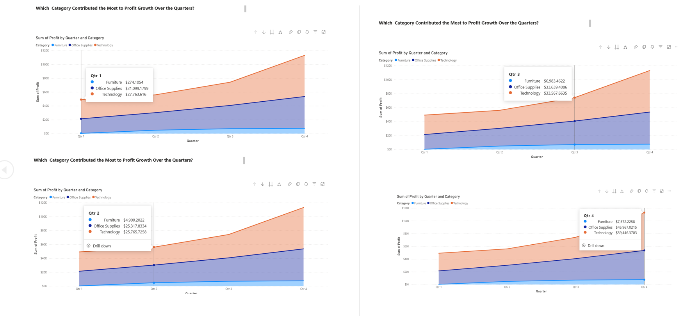
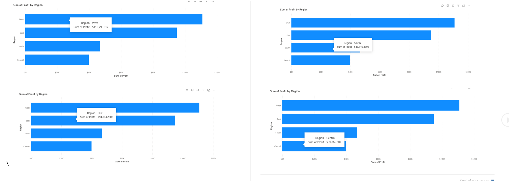
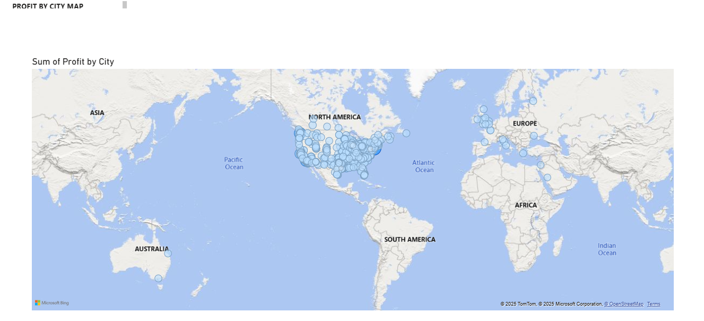
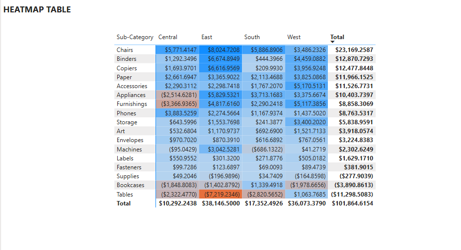

## Interactive visualizations built from the Global Superstore dataset, showcasing profit trends across categories, regions, and time.This project highlights how modern BI tools can transform raw data into actionable business insights

##  Profit Growth by Quarter & Category  

**ViZ:** Area Chart  

 **Which Category Contributed the Most to Profit Growth Over the Quarters?**

  

**Analysis by Quarter**  

- **Q1:** Technology ($27.8K) contributed the most, followed by Office Supplies ($21.1K). Furniture was almost negligible (~$0.3K).  
- **Q2:** Office Supplies ($25.3K) and Technology ($25.8K) were nearly equal. Furniture grew slightly to ~$4.9K.  
- **Q3:** Technology ($33.6K) and Office Supplies ($33.6K) continued to expand, while Furniture (~$7.0K) stayed relatively small.  
- **Q4:** Technology surged to ~$59.4K, Office Supplies to ~$46.0K, and Furniture reached ~$7.6K.  

**Insight:**  
Technology showed **consistent leadership in profit growth**, ending with a major spike in Q4. Office Supplies delivered **steady, reliable growth** across all quarters, while Furniture’s contribution remained **minor but positive**. 
This visualization provided a clear comparative view of how each category drove profitability over time, enabling better strategic focus on the most profitable segments.

###  Profit by Region  

**ViZ:** Bar Chart  

**Which region contributed the most to overall profit, and how do profits compare across regions?**

  
**Analysis:**  
- **West Region**: Highest profit at **~$111K**.  
- **East Region**: Strong performance with **~$95K**.  
- **South Region**: Mid-level profit of **~$47K**.  
- **Central Region**: Lowest profit at **~$40K**.  

**Insight:**  
- Profits are dominated by the **West and East regions**, showing these as key markets.  
- **Central region** underperforms, signaling opportunities for deeper market research and targeted strategies.

  

  ###  Profit by City (Map)

**Which cities drive the highest profit, and how is profit geographically concentrated?**

**ViZ** Map

**Analysis**
- Profit is **densest across U.S. cities** (North America cluster) — primary revenue engine.
- **Western & Central Europe** show a secondary but meaningful cluster.
- **Sparse activity** in Africa, South America, and Australia → limited penetration or smaller orders.
- Pattern suggests advantages in **market maturity, logistics, and customer density** in the U.S. and select EU hubs.
## 🔗 Dashboard Access  
[Click here to view the interactive Power BI dashboard](https://app.powerbi.com/links/EAC4Qne9Qk?ctid=51aa8f26-2e23-4b8c-bca8-7cc441adc4df&pbi_source=linkShare)  

## Heatmap Analysis  

**Which sub-categories and regions contribute the most and least to overall profit?**

**ViZ:** Heatmap  

**Analysis:**  
- Chairs, Binders, and Paper are the top contributors, especially in the **East region**.  
- Tables, Bookcases, and Supplies show **consistent losses**, with Tables recording the **largest negative profit (-$11.3K)**.  
- The **East ($38.1K)** and **West ($36.0K)** regions drive most of the overall profitability, while Central trails behind at ~$10.2K.  

This heatmap highlights where profitability is strongest and reveals sub-categories that need strategic improvement.  

##  Dashboard Access  

[Click here to view the interactive Power BI dashboard](https://app.powerbi.com/links/dHSnjgjmhb?ctid=51aa8f26-2e23-4b8c-bca8-7cc441adc4df&pbi_source=linkShare)  

